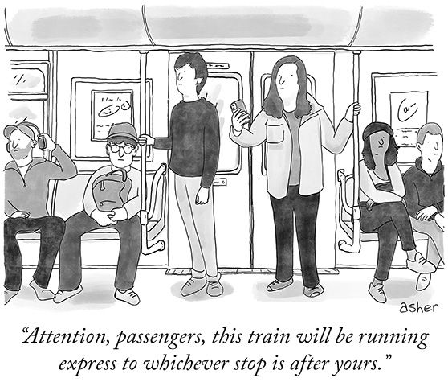

<div align="center">

# <b>Mosaic</b>

### Generating The New Yorker Style Cartoons using Stable Diffusion



</div>

## Introduction

The New Yorker Style cartoons feature an intricate blend of whimsical art style, witty humor, and a subtle commentary on
modern life.  Cartoon enthusiasts and creative professionals alike know that creating such cartoons can be a daunting
task that requires both artistic talent and a knack for satire.

In this project, we aim to explore techniques to simplify the cartoon creation process by using Text-to-Image Diffusion
models to specifically **generate high-quality The New Yorker Style cartoons from natural language captions.**

We demonstrate how to fine-tune a Stable Diffusion model on a custom dataset of {image, caption} pairs. We build on top
of the fine-tuning script provided by Hugging Face [here](https://github.com/huggingface/diffusers/blob/main/examples/text_to_image/train_text_to_image.py).


## Dataset

We use [The New Yorker Caption Contest](https://huggingface.co/datasets/jmhessel/newyorker_caption_contest) dataset.
Refer to [the documentation](https://huggingface.co/datasets/jmhessel/newyorker_caption_contest) for more details.

## Fine-tuning

A Stable Diffusion model can be decomposed into several key components:

- A text encoder that projects the input prompt to a latent space. (The caption associated with an image is referred to as the "prompt".)
- A variational autoencoder (VAE) that projects an input image to a latent space acting as an image vector space.
- A diffusion model that refines a latent vector and produces another latent vector, conditioned on the encoded text prompt.
- A decoder that generates images given a latent vector from the diffusion model.

## Training

Fine-tuning code is provided in `finetune.py`. Before running training, ensure you have the dependencies (refer to `requirements.txt`) installed. See **Usage** for more details.

When you launch training, a diffusion model checkpoint will be generated epoch-wise only if the current loss is lower
than the previous one.

For avoiding OOM and faster training, it's recommended to use a V100 GPU at least. We used an RTX8000.

**Note**: For the scope of the project, only the diffusion model is fine-tuned. The VAE and the text encoder are kept frozen.

### Fine-tuned weights

You can find the fine-tuned diffusion model weights [here](./checkpoints/README.md)

## Inference

You can bring in your weights or load the fine-tined model weights and reuse the code snippet below to generate some images.

```python
import keras_cv
import matplotlib.pyplot as plt
from tensorflow import keras

IMG_HEIGHT = IMG_WIDTH = 512


def plot_images(images, title):
    plt.figure(figsize=(20, 20))
    for i in range(len(images)):
        ax = plt.subplot(1, len(images), i + 1)
        plt.title(title)
        plt.imshow(images[i])
        plt.axis("off")


# We just have to load the fine-tuned weights into the diffusion model.
weights_path = keras.utils.get_file(origin="<link-to-the-model-here>")
fine_tuned = keras_cv.models.StableDiffusion(
    img_height=IMG_HEIGHT, img_width=IMG_WIDTH
)
fine_tuned.diffusion_model.load_weights(weights_path)

# Generate images.
generated_images = fine_tuned.text_to_image("A man is sitting in an office on his computer. He's speaking with a rat man, who is at his computer", batch_size=3)
plot_images(generated_images, "Fine-tuned on The New Yorker Caption Contest Dataset")
```

## Results

Actual Cartoon | Stable Diffusion | Fine-tuned Stable Diffusion Model |
:-------------------------:|:-------------------------:|:-------------------------:
  |   |


## Usage

**Note: It's highly recommended that you use a GPU with at least 30GB of memory to execute the code.**

1. Clone the repository
    ```bash
    git clone git@github.com:utsavoza/mosaic.git
    ```
2. Setup and activate the virtual environment
    ```bash
    python3 -m venv .
    source ./bin/activate
    ```
3. Install the required dependencies
    ```bash
    pip install -r requirements.txt
    ```
4. Fine-tuning the stable diffusion model
    ```bash
    python finetune.py --mp --num_epochs=80
    ```

Alternatively, the model can also be finetuned by running the example notebooks on a GPU enabled machine or by
scheduling a batch job on an HPC cluster using `sbatch scripts/finetune.sbatch`.

## References

The code and techniques used in this project are adapted from this excellent guides on [Textual Inversion](https://keras.io/examples/generative/fine_tune_via_textual_inversion/) and [Fine-Tuning
Stable Diffusion models](https://keras.io/examples/generative/finetune_stable_diffusion/), with neccesary changes made to achieve the goal of the project.

## License

This project is licensed under MIT License. See [LICENSE](./LICENSE).
